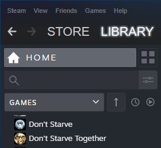
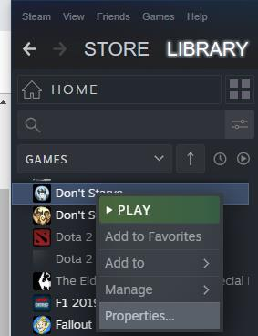
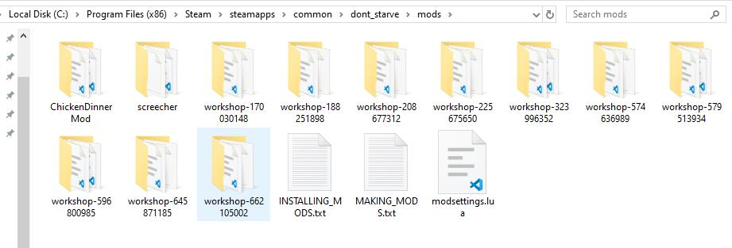
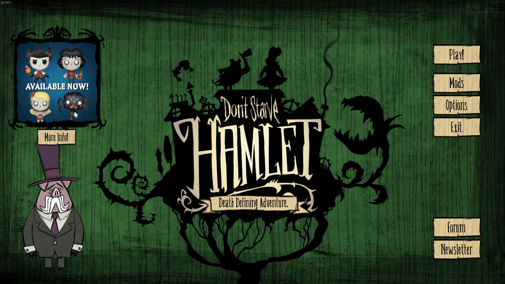
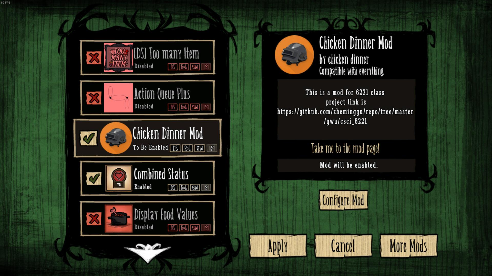
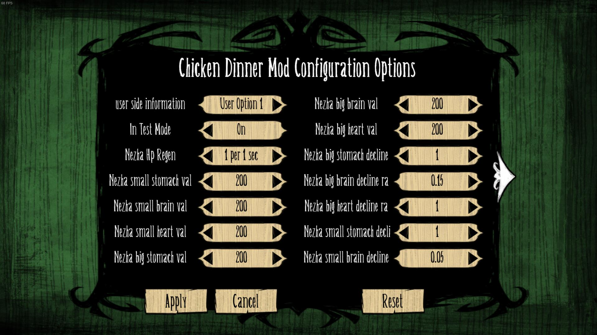
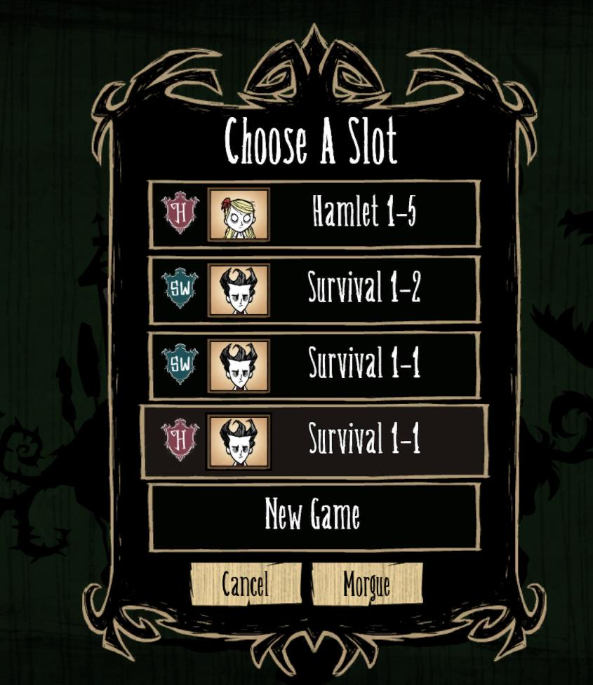
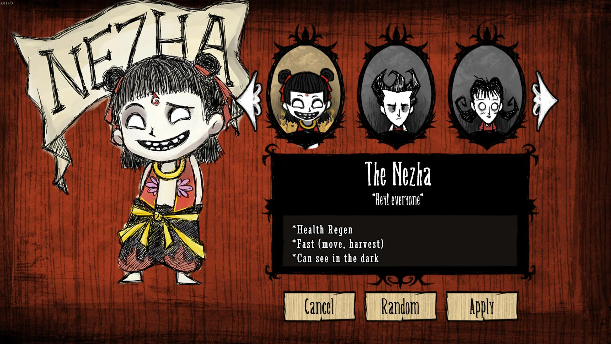
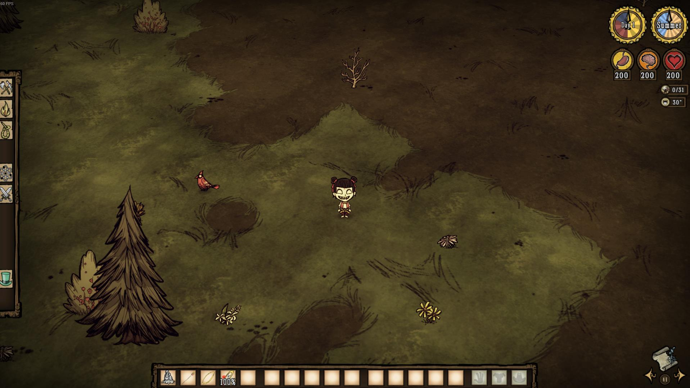

# User Guide 
## 1. Get don't starve
If you don't have "Don't Starve", do not hesitate and buy one in steam, it's really a good game.

Log in steam, go to your library, find your "Don't starve" then right click it, then choose properties.

In properties window, choose LOCAL FILES, then BROWSE LOCAL FILES. Go to mod folder.
![properties window]UserGuideImages/properties_window.jpg)

## 2. install our Mods
To install our mod, copy paste ChickDinner folder into mod folder 

## 3. start our mods
### easy start
Start your don't starve, in main menu, Hit "Mods" button.

In mods page, find our mod which names "Chicken Dinner Mod", double click it, and it would show "To be Enabled",

If you want to active our mod, then hit "Apply" button.

### Advanced operation
After it change into "to be enabled", You can hit "Configure Mod" button, and go to Configure page to adjust parameters of Nezha character.

## 4. Start a new game with our mods
After enable our mods, you'll come back to main menu. It's time to start a new game!

Hit "Play!" button, Hit "New Game" Choose "DS"or what ever you want, then hit "Character" and go to character choose menu, hit left arrow, and find our new character names The Nezha, hit "Apply" button to choose Nezha as character. Now you can start game.

## 5. Nezha in game 
Initially nezha will generate in game with 3 items: qiankunquan , huntianling, and fenghuolun

For detailed information, please see the [DesignOfNeZha.md](ChickenDinner/docs/DesignOfNeZha.md)